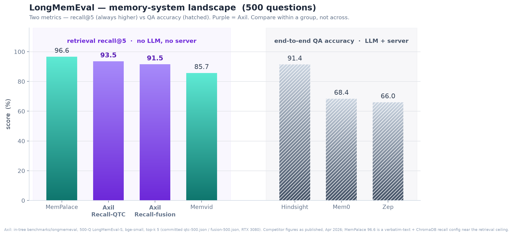

<div align="center">

<pre>
 █████╗  ██╗  ██╗ ██╗ ██╗     
██╔══██╗ ╚██╗██╔╝ ██║ ██║     
███████║  ╚███╔╝  ██║ ██║     
██╔══██║  ██╔██╗  ██║ ██║     
██║  ██║ ██╔╝ ██╗ ██║ ███████╗
╚═╝  ╚═╝ ╚═╝  ╚═╝ ╚═╝ ╚══════╝
</pre>

### Agent memory in one local file. No server, no cloud, no LLM.

*A memory that compounds: every session it learns, links, and prunes — so your agent starts tomorrow smarter than it ended today.*

**Built in Rust · local-first · single ~5–10MB binary · vector + graph + full-text + time-series · MCP · up to ~80% fewer context tokens on large, semantic-search workloads**

[](https://github.com/FC4b/axildb/actions/workflows/ci.yml)
[](LICENSE)


[**Quick start**](#quick-start) · [**Why Axil**](#why-axil) · [**Token savings**](#token-savings--real-savings) · [**Benchmarks**](#benchmarks) · [**Extensible**](#extensible-by-design) · [**Docs**](#documentation)

</div>

---

Your coding agent is brilliant and amnesiac. Every session it re-reads the same files, re-learns the same architecture, repeats the same mistakes — and **burns tokens (your money) doing it.** Axil is the second brain that fixes this: it remembers your decisions, gotchas, and code structure across sessions, then hands the agent the *right* memory at the right moment instead of dumping the whole repo into context. When your agent outgrows a markdown notes file, the next step isn't a cloud platform — it's a smarter file.

> **In a real, equal-correctness A/B test, agents answered the same coding questions with up to ~80% fewer context tokens on a large repo with semantic "where/how" queries (≈ parity on a tiny repo where `grep` already nails it).** → [the numbers & caveats](#token-savings--real-savings)

Good agent memory has to be four things — navigable, fast, fresh, and compounding. Axil is all four, locally, for the code domain:

- 🕸️ **Navigable** — not a flat log but a graph you can walk: a knowledge graph of typed edges, a SCIP **code-graph** (real callers/callees, not keyword guesses), and **version-pinned dependency-doc memory** (your *exact* lib versions, zero network) — fused with vector, full-text, and time-series in one `.axil` file. Ask "where is X" and get a pointer in **~100 tokens**, not a stack of file reads.
- ⚡ **Fast** — a file you embed, not a server you run: no Postgres, no cloud, no daemon. **<100 ms** commands from a ~5–10 MB binary, zero network hop, fully offline.
- 🔄 **Fresh** — memory that keeps up with the code: background hooks auto-capture decisions and errors as you work, and SCIP + dep-doc **drift detection** refreshes indexes only when they've gone stale (`--if-stale`) — recall tracks the code as it moves.
- 🧠 **Compounding** — memory that gets *better* across sessions, not just bigger: active forgetting (decay + reinforcement), a belief system, consolidation with contradiction detection, and structured checkpoints — all rule-based, **no LLM required**.
- 🔗 **One memory, every tool** — the same portable `.axil` brain is read *and* written by Claude Code, OpenAI Codex, GitHub Copilot CLI, Factory Droid, Google Antigravity, Qwen Code, OpenCode, Cursor, any MCP client, or your own Rust. No vendor lock-in.

## Quick start

**1. Install** — a prebuilt `axil` binary, no toolchain, no ~3-min compile. The archives **bundle a known-good ONNX runtime next to the binary**, so vector search and embeddings work out of the box (including on Windows):

```bash
# Prebuilt binary, no source build — fetches the platform archive from the releases page.
cargo binstall axildb          # https://github.com/cargo-bins/cargo-binstall

# …or download an archive for your platform from the releases page and extract it
# (keep the bundled onnxruntime library next to `axil`):
#   https://github.com/FC4b/axildb/releases/latest
```

<details>
<summary><b>Build from source instead</b> (needs a C toolchain; <code>cargo install</code> compiles ONNX)</summary>

```bash
cargo install axildb                     # installs the `axil` binary · default features ≈ everything
# or: git clone https://github.com/FC4b/axildb.git && cd axildb && cargo build --release -p axildb
```

`cargo install` builds from source and copies only the binary to `~/.cargo/bin` — on Windows it leaves the `download-binaries` `onnxruntime.dll` behind in `target/`, so the embedder fails ONNX init at first use. Prefer `cargo binstall` above, which bundles the runtime. If you must `cargo install`, drop a matching `onnxruntime.dll` (ORT ≥ 1.22) next to `axil.exe`. See [Installation](docs/src/getting-started/installation.md#windows--onnx).

</details>

**2. Wire it into your project** (recommended — agent memory). One command wires Axil into your coding-agent project and indexes your code. From there the agent does the work: hooks inject context before each turn, capture decisions and errors as you go, and write a checkpoint at the end.

```bash
axil install                               # interactive: detects the agents in your project and wires them
axil install --claude-code --bootstrap     # or name one: wire hooks + skills AND index your code, in one shot
```

That's the whole setup. To *see the payoff immediately*, ask "where is X" the frugal way:

```bash
axil code-search "login handler"           # token-frugal "where is X?" — a pointer in ~100 tokens, not a file dump
```

Everything else runs itself, but you can drive it by hand any time:

```bash
axil boot                                  # "resume here" — recent decisions, errors, open threads
axil recall "auth timeout" --top-k 5       # cognitive recall (vector + graph + recency + keyword)
axil store decisions '{"summary":"Use JWT","reason":"simpler than OAuth","files":["auth.rs"]}'
axil checkpoint      '{"goal":"ship auth","state":"tests green","next_steps":["wire refresh"]}'
```

The DB auto-detects at `.axil/memory.axil`, so everyday commands need no `--db`.

→ Full install options (feature flags, SCIP indexers, manual setup): [Installation](docs/src/getting-started/installation.md).

**Using another agent?** The same one command wires the full memory loop — the same brain, spoken in each tool's hook dialect — for **seven terminal agents**: `--claude-code`, `--codex` (OpenAI Codex), `--copilot` (GitHub Copilot CLI), `--droid` (Factory Droid), `--antigravity` (Google Antigravity), `--qwen` (Qwen Code), and `--opencode`. IDE rules files are one command too: `--cursor` (`.cursor/rules/`), `--windsurf` (`.windsurfrules`), or `--aider` (`CONVENTIONS.md`). `--all` sets up every detected agent at once. See the **[Terminal Agents guide](docs/src/agents/terminal-agents.md)**. For any MCP client, register the stdio server in one step — see the **[MCP Server guide](docs/src/agents/mcp.md)**:

```bash
claude mcp add axil -- axil --db ./.axil/memory.axil mcp   # the DB is the global --db flag, not positional
```

<details>
<summary><b>Path B — standalone CLI</b> (drive Axil directly as a memory store)</summary>

Set `AXIL_DB` once and skip `--db` on every command:

```bash
axil init ./memory.axil                              # create a database
export AXIL_DB=./memory.axil                          # so the rest need no --db

axil store decisions '{"choice":"Use JWT"}'          # store (any table + JSON)
axil recall "auth issues" --top-k 5                   # semantic recall (local ONNX, no key)
axil fts "timeout error"                              # full-text search
axil link <a> mentions <b>                            # knowledge-graph edge
axil traverse <a> "->mentions->entity"                # multi-hop walk
axil ql 'RECALL "auth error" TOP 5'                   # AxilQL one-shot
```

`axil --help` lists every command; `axil doctor` checks health. → [Quick Start](docs/src/getting-started/quick-start.md) · [CLI reference](docs/src/cli/data.md).

</details>

<details>
<summary><b>Use it from Rust</b> (embed the engine directly)</summary>

```rust
use axil_core::Axil;
use axil_vector::{models::EmbeddingModel, AxilBuilderVectorExt};
use axil_graph::AxilBuilderGraphExt;
use axil_fts::AxilBuilderFtsExt;

let db = Axil::open("./memory.axil")
    .with_embedder_model(EmbeddingModel::BgeSmall)?  // Engine: vector
    .with_graph_engine()?                            // Engine: graph
    .with_fts_engine()?                              // Engine: full-text
    .build()?;

let session = db.insert("sessions", serde_json::json!({ "summary": "Fixed auth timeout" }))?;
db.embed_field(&session.id, "summary")?;
let hits = db.query().similar_to("auth error", 5).exec()?;
```

→ [Embedded Usage](docs/src/api/embedded.md) · [Query Builder](docs/src/api/query-builder.md) · [Plugin Traits](docs/src/api/plugin-traits.md)

</details>

## Why Axil?

The honest version — what you'd otherwise reach for, what it costs you, and where Axil fits:

| You could reach for… | What it costs you | Axil |
|----------------------|-------------------|------|
| **A markdown notes file** | No retrieval or ranking — it grows unbounded and you paste the *whole* thing into context every turn | Ranked recall + active forgetting; hands the agent the *right* memory, not all of it |
| **A vector DB** (pgvector, Chroma) | A service to run, and vectors *only* — no graph, no full-text, no cognition; you bolt an LLM on for extraction | One embedded file fuses vector + graph + full-text + time-series; rule-based cognition, **no LLM required** |
| **An LLM-memory framework** (Mem0, Zep, Letta) | Needs an LLM **and** external databases just to store a memory; lower recall in our tests ([below](#benchmarks)) | No LLM, no server, no daemon — a ~5–10 MB binary, 100% offline, higher recall |
| **A managed context engine** (Redis Iris / Agent Memory) | A cloud account and four managed services — or self-hosting Python + Docker + Redis + background workers — plus an LLM key just to extract memories | One offline binary, algorithmic extraction — no account, no cloud, no LLM |
| **A single-file doc store** (Memvid) | Local and single-file like Axil — but a smart *doc* store: no knowledge graph, no entity extraction, no memory types | Structured agent memory: code-graph, entity inference, 5 memory types, consolidation |

## Token savings = real savings

**Same questions, same correct answers — fewer context tokens, most on large repos with semantic queries.** Not a synthetic estimate — a real, end-to-end A/B test: clone one public repo into two identical sandboxes, give an agent the same "where is X / how does Y work" tasks in each — one with only `grep` + file reads, the other with only Axil — and count the context tokens each burns **to reach a verified-correct answer**.

| Corpus | "where/how" query | Context-token reduction |
|--------|-------------------|------------------------:|
| **Django** (906 source files) | semantic (not directly greppable) | **~73–80%** |
| **Flask** (24 source files) | symbol is directly greppable | **≈ parity** |

Concrete: on Django, resolving the URL dispatcher cost an unaided agent **2,250 tokens** of grep-and-read versus **193 tokens** for two Axil `code-search` calls. On a tiny repo like Flask, `grep` already nails the answer, so it's roughly break-even — the win scales with repo size and how *semantic* (vs directly greppable) the question is. The defensible, equal-correctness figure is **~73% on large/semantic workloads, parity on small**.

> ⚠️ **A specific experiment, not a guarantee.** Two open-source Python repos, a disciplined agent, measured at equal task-correctness. Real savings depend on repo size and question type — **largest on big codebases and semantic "where/how" questions**, near break-even on tiny repos where `grep` already nails it. Reproduce: `scripts/context-ab-setup.sh`. Full methodology and every run: [Context Economics](docs/src/advanced/context-economics.md).

## What you get

Everything below normally means standing up a vector DB **and** Neo4j **and** Elasticsearch **and** an LLM extraction pipeline. Axil is all of it in **one ~5–10 MB binary, no server, no LLM** — with real agent cognition, not just storage:

**🧠 Cognitive memory (no LLM required)** — 5 memory types (working, semantic, episodic, procedural, preference) · auto-importance scoring · active forgetting (decay + reinforcement) · belief system · auto-capture of errors & decisions · consolidation & contradiction detection.

**🔎 Multi-model retrieval** — HNSW vector search (local ONNX/BGE) · a **temporal knowledge graph** (typed edges, traversal, entity extraction + inference, time-aware `as_of` queries — no Neo4j) · Tantivy full-text · time-series. One `recall()` fuses them all (RRF) with per-result score explanations.

**💻 Built for code agents** — structural code index + `code-search` / `code-context` (pointer-shaped, token-frugal) · SCIP cross-reference graph · version-pinned dependency-doc memory · structured session checkpoints · AxilQL · MCP server (full CLI parity).

**🔌 Optional LLM upgrade** — plug in Claude / GPT / Ollama (or Claude Code skills) to sharpen entity extraction & consolidation beyond the algorithmic defaults. Everything above runs without it.

## Benchmarks

**Top-tier retrieval recall — with no LLM and no server.** On LongMemEval retrieval recall@5, Axil is the strongest *structured* memory among no-LLM, no-server systems — within ~3 points of MemPalace (a verbatim-text + ChromaDB config near the retrieval ceiling) and ahead of Memvid — from a file you embed. The LLM/server systems (Hindsight, Mem0, Zep) report end-to-end QA accuracy, a different and always-lower metric, so they're landscape context, not a head-to-head. SQLite-shaped accuracy, no daemon to run.

**LongMemEval** — 500 questions, grouped by metric (recall@5 is always higher than QA accuracy — compare within a metric, not across):

<div align="center">
  
</div>

| System | Score | Metric | No LLM | No server |
|--------|------:|--------|:------:|:--------:|
| MemPalace | 96.6% | recall@5 | ✅ | ✅ |
| **Axil — Recall-QTC** | **93.5%** | recall@5 | ✅ | ✅ |
| **Axil — Recall (fusion)** | **91.5%** | recall@5 | ✅ | ✅ |
| Memvid | 85.7% | recall@5 | ✅ | ✅ |
| Hindsight | 91.4% | QA accuracy | ❌ | ❌ (PostgreSQL) |
| Mem0 | 68.4% | QA accuracy | ❌ | ❌ (3 DBs) |
| Zep | 66.0% | QA accuracy | ❌ | ❌ |

> **Two metrics — don't cross-compare.** Retrieval recall@5 asks *did the answer-bearing session land in the top-5?*; end-to-end QA accuracy asks *did the system answer correctly?* — and recall is always the higher number. Axil, MemPalace, and Memvid are no-LLM systems measured on recall; Hindsight, Mem0, and Zep report QA accuracy. MemPalace's 96.6% is a verbatim-text + ChromaDB recall config near this dataset's ~96% retrieval ceiling.

And it's small and fast where it counts:

- **100% needle-recall (6/6), CI-enforced** — every build runs [`scripts/needle-recall-gate.sh`](scripts/needle-recall-gate.sh): a planted fact must come back in the top-5 with its distinctive token intact, or the build fails.
- **~173× faster vector search** than SQLite + sqlite-vec at 100k vectors *(in-tree [`sqlite-compare`](benchmarks/sqlite-compare) harness; CI gates a reduced-n speedup floor, the 100k figure is a local run)*.
- Competitive recall at a fraction of the per-query token budget *(estimate — assumes ~950 tokens/query; see [methodology](docs/src/advanced/benchmarks.md))*.
- **<100 ms** commands from a **~5–10 MB** offline binary — no LLM call, no network, no daemon.

> *Competitor figures (MemPalace, Hindsight, Mem0, Zep, Memvid) are cited from the published LongMemEval landscape as of April 2026 — recall@5 for the no-LLM systems, end-to-end QA accuracy for the LLM/server ones — not measured by Axil.* Axil's LongMemEval harness is **in-tree** at [`benchmarks/longmemeval`](benchmarks/longmemeval); both Axil figures are committed 500-question baselines — Recall-QTC **93.5%** ([`qtc-500.json`](benchmarks/results/qtc-500.json)) and Recall-fusion **91.5%** ([`fusion-500.json`](benchmarks/results/fusion-500.json)) — re-measured 2026-06-27 on the current build (`bge-small`, top-k 5, ONNX Runtime CUDA on an RTX 3080). The LongMemEval-S dataset is out-of-tree, so the CI gate skips-loud (a green run never means it re-verified); re-run locally with the dataset present. HNSW retrieval is approximate, so recall varies ~1pp build-to-build. The `sqlite-compare`, **needle-recall**, and Criterion hot-path harnesses are all in-tree (the first two CI-gated). → Full tables, per-category breakdown, and methodology: **[Benchmarks](docs/src/advanced/benchmarks.md)**.

## How it works

After the one-command setup above, **the loop runs itself** — every session, with zero prompting from you:

<div align="center">
<pre>
   ┌───────────────┐      ┌────────────────────┐      ┌─────────────────────┐
   │   1. BOOT     │ ───▶ │    2. WORK         │ ───▶ │   3. CHECKPOINT     │
   │ inject recent │      │ recall on demand   │      │ write "resume here" │
   │ context from  │      │ + auto-capture     │      │ so the next session │
   │ .axil &lt;100 ms │      │ decisions &amp; errors │      │ resumes, not restart│
   └───────────────┘      └────────────────────┘      └─────────────────────┘
          ▲                                                       │
          ╰──────────────  next session boots from it  ◀──────────╯

   one .axil file · no server · no LLM · &lt;100 ms · 100% offline
</pre>
</div>

A **PreToolUse** hook boots context before the agent's first move, file edits and fixes are auto-captured as they happen, and a **Stop** hook checkpoints at the end. No prompts to write, no memory tool to remember to call — your agent just stops re-discovering the same codebase every session.

## Extensible by design

The headline features aren't bolted on — they're plugins. The SCIP code-graph and dependency-doc memory are *Extensions*, built on the same public API you'd use. So the plugin model isn't a diagram; it's load-bearing.

That tiered, sandboxable plugin architecture is something **no other agent-memory system ships** — Memvid, Mem0, Hindsight, HelixDB, and Zep are all fixed feature sets. Axil is a small core in three tiers, each a Cargo feature, so you build exactly what you need:

```bash
# default = everything; or compose your own — a lean code-agent build:
cargo install axildb --no-default-features \
  --features "core,vector,embed,graph,fts,timeseries,memory,scip,deps,checkpoint,mcp,ql"
#   Engines    (Tier 1 · storage)      : vector embed graph fts timeseries
#   Extensions (Tier 2 · capabilities) : memory indexer scip deps checkpoint rerank
#   Adapters   (Tier 3 · surfaces)     : mcp ql http
```

- **Engines** — storage substrates; each owns a companion file beside your `.axil`.
- **Extensions** — capabilities on top (memory, SCIP code-graph, dependency-doc memory, rerank, checkpoints). Add your own without forking the core.
- **Adapters** — how the world talks to it (CLI, MCP, AxilQL) — same engine underneath. The MCP server mirrors the full CLI; AxilQL is the query surface.

**Drop a feature and it compiles out** — its commands vanish, but your `.axil` **data stays compatible and dormant**. Re-add the feature later and it's live again, no migration. That's build-time. **Run-time** behavior is tuned in an optional `axil.toml` (project root, or `~/.config/axil/axil.toml`):

```toml
[database]
path = "./.axil/memory.axil"

[index]
embedding_model = "bge-small-en-v1.5"    # local ONNX, auto-downloaded
embedding_dimensions = 384

[fts]
default_limit = 10

[llm]                                     # optional — Axil works fully without it
endpoint = "https://api.openai.com/v1"
model = "gpt-4o-mini"                     # api_key via AXIL_LLM_API_KEY env var
```

→ Build your own: [Three Tiers](docs/src/extending/overview.md) · [Engines](docs/src/extending/engines.md) · [Extensions](docs/src/extending/extensions.md) · [Adapters](docs/src/extending/adapters.md) · [Configuration](docs/src/getting-started/configuration.md)

## Documentation

| Topic | Pages |
|-------|-------|
| **Getting started** | [Install](docs/src/getting-started/installation.md) · [Quick Start](docs/src/getting-started/quick-start.md) · [Configuration](docs/src/getting-started/configuration.md) |
| **Concepts** | [Architecture](docs/src/concepts/architecture.md) · [Memory Types](docs/src/concepts/memory-types.md) · [Engines](docs/src/concepts/plugins.md) · [Storage Model](docs/src/concepts/storage.md) |
| **CLI reference** | [Data](docs/src/cli/data.md) · [Memory](docs/src/cli/memory.md) · [Code Search](docs/src/cli/code-search.md) · [Diagnostics](docs/src/cli/diagnostics.md) · [AxilQL](docs/src/cli/axilql.md) · [Dependency Docs](docs/src/cli/dependency-docs.md) |
| **Agent integration** | [Claude Code](docs/src/agents/claude-code.md) · [Terminal Agents](docs/src/agents/terminal-agents.md) · [MCP Server](docs/src/agents/mcp.md) · [Multi-Agent](docs/src/agents/multi-agent.md) |
| **Deep dives** | [Benchmarks](docs/src/advanced/benchmarks.md) · [Context Economics](docs/src/advanced/context-economics.md) · [Retrieval Pipeline](docs/src/advanced/retrieval-pipeline.md) · [Cognitive Memory](docs/src/advanced/cognitive.md) |
| **Extending Axil** | [Three Tiers](docs/src/extending/overview.md) · [Engines](docs/src/extending/engines.md) · [Extensions](docs/src/extending/extensions.md) · [Adapters](docs/src/extending/adapters.md) |

## Status & license

**Usable today.** The core engine, every plugin, agent memory, and diagnostics are implemented and run — it's a single offline binary you can install and point at a real project right now. The in-tree Criterion hot-path suite runs in-repo; the retrieval-quality benchmark harnesses (LoCoMo / LongMemEval / SQLite-compare) are historical and archived out of the repo, so those numbers are not regenerated here. Still in progress: more examples, CI/CD, and a hosted docs site (the docs themselves are linked above).

**Free for noncommercial use.** Axil is source-available under the [PolyForm Noncommercial License 1.0.0](LICENSE):

- **Free** — personal projects, research, education, nonprofits, and evaluation.
- **Commercial license** — required for commercial use; see [LICENSING.md](LICENSING.md).

**Axil Atlas** (the multi-database team/sync control plane) is a separate commercial product. The engine here runs fully standalone — no Atlas, no server, no cloud dependency.

## Star history

If Axil saves your agents tokens, a star helps others find it. ⭐

<a href="https://star-history.com/#FC4b/axildb&Date">
  
</a>

## Contributing

Issues, feedback, and PRs are all welcome — open an issue to start a discussion. Try it first, then tell us where it surprised you:

```bash
git clone https://github.com/FC4b/axildb.git && cd axildb
cargo build && cargo test
axil install --claude-code --bootstrap   # wire it into a real project and see the loop run
```
